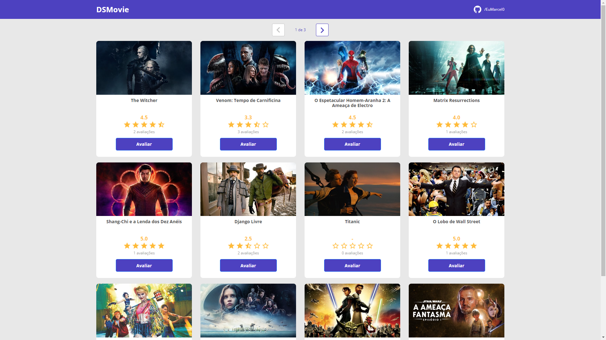
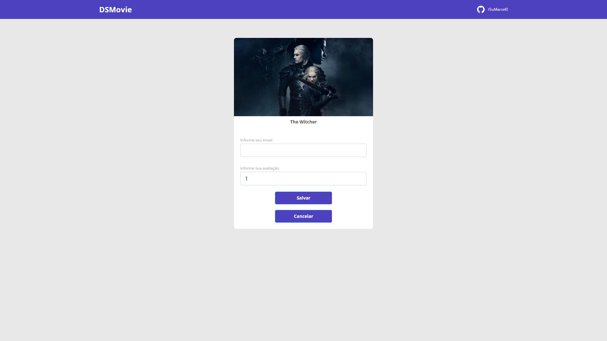

# DSMovie

Esta aplicação foi desenvolvida em bootcamp da [DevSuperior](https://devsuperior.com.br/cursos), sob às orientações do excelente professor Nélio Alves. 
Nela avaliamos filmes que chegam através de uma API externa e guardamos todas as notas e emails no banco de dados. 
Tendo essas notas em mãos, no back-end foi criado um código para recuperar a média de cada filme e mostrá-la nos itens da página inicial.

## 🚀 Começando

Para visualizar o projeto, basta acessar aqui: https://project-dsmoive.netlify.app/

### 🎥 Usabilidade e funcionalidades

Basta selecionar o filme que deseja informar uma nota, inserir seu email e a sua avaliação, valor de 1 a 5.

## 🛠️ Construído com

Todo o projeto foi construído utilizando:

* [Bootstrap](https://getbootstrap.com/docs/5.2/getting-started/introduction/)
* [ReactJS](https://pt-br.reactjs.org/docs/getting-started.html)
* [TypeScript](https://www.typescriptlang.org/docs/)
* [Java-SpringBoot](https://docs.spring.io/spring-boot/docs/current/reference/htmlsingle/)
* [Font Awesone](https://fontawesome.com/docs)
* [Netlify](https://www.netlify.com/)
* [Heroku](https://devcenter.heroku.com/)

## 📌 Versão

Todo controle de versão foi realizado dentro do repositório do GitHub.

## ✒️ Autores

* **Marcelo Silva** - *Todo front-end da aplicação* - [/EuMarcel0](https://github.com/EuMarcel0)

## 📄 Licença

Open Source - Código e direitos do professor Nélio Alves

## 🎁 Expressões de gratidão

Fico muito grato por ter concluído este projeto, pois foi o primeiro contato com ReactJS, e, confesso, que foi amor à primeira vista por esta biblioteca. 
Graças à Deus deu tudo certo no final.
💻🚀😊😊
